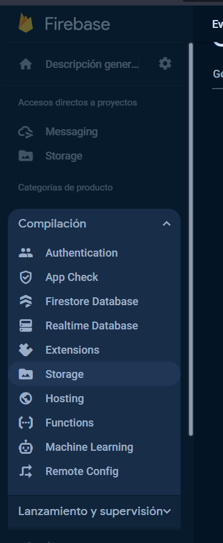
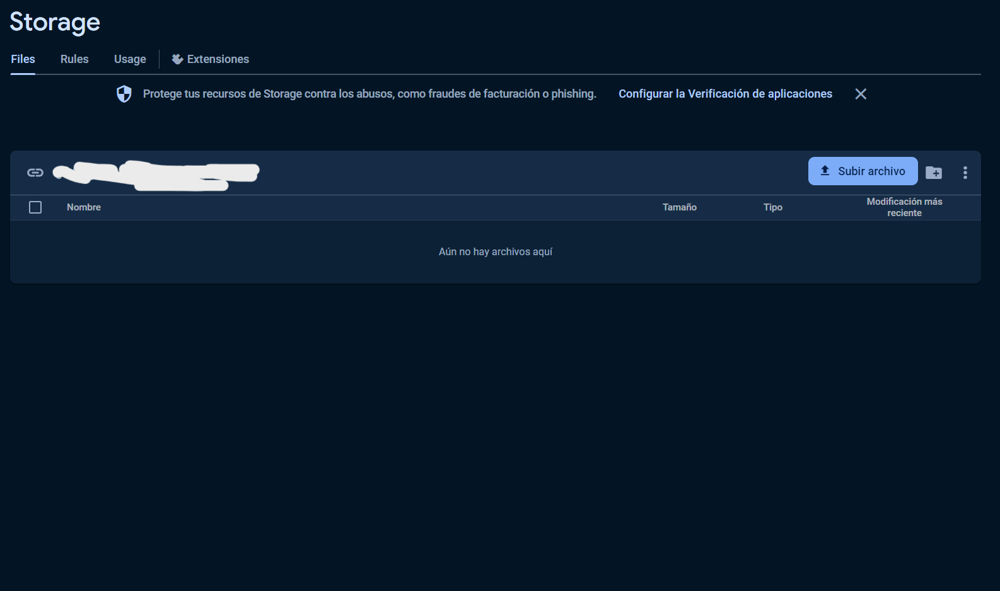
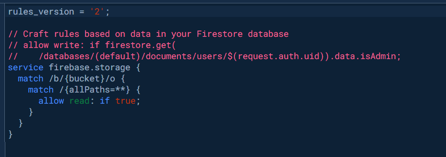
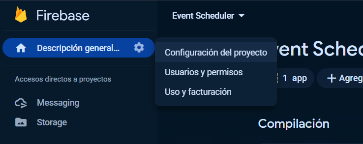
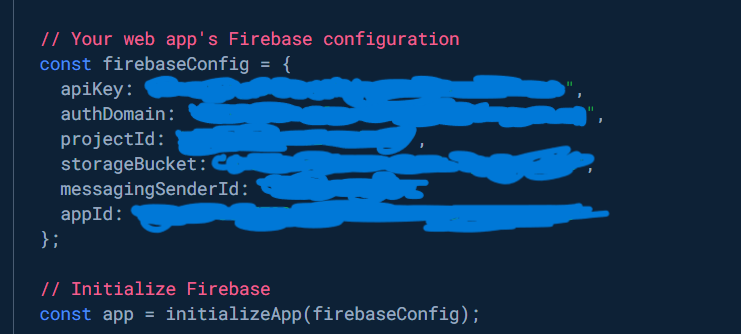
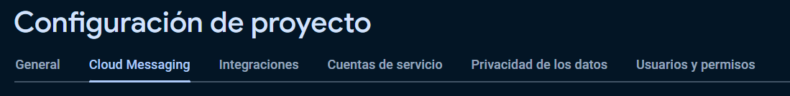
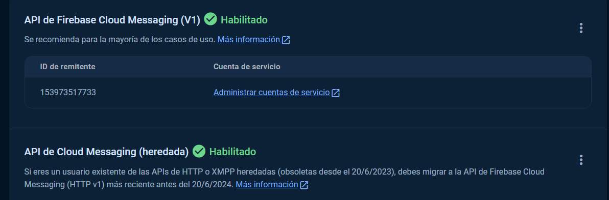
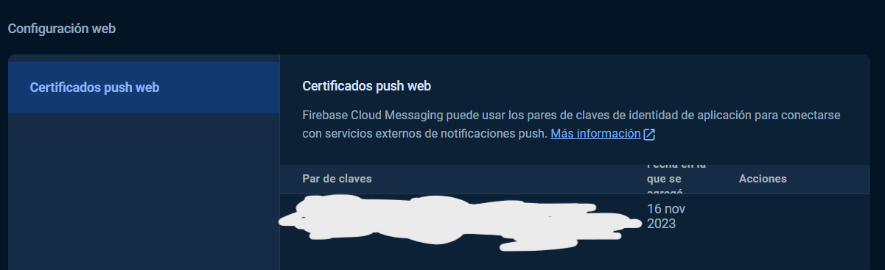

# COMO EJECUTAR LA APP

## Firebase

1. Debe crear un archivo `.env` en la raíz del proyecto.

2. Copie el contenido del archivo `.env.example` y páselo al archivo `.env` que ha creado.

El `.env` debería verse asi:

```py
# API
VITE_REACT_BASE_API_URL=

# FIREBASE
VITE_REACT_FIREBASE_API_KEY=
VITE_REACT_FIREBASE_AUTH_DOMAIN=
VITE_REACT_FIREBASE_PROJECT_ID=
VITE_REACT_FIREBASE_STORAGE_BUCKET=
VITE_REACT_FIREBASE_MESSAGING_SENDER_ID=
VITE_REACT_FIREBASE_APP_ID=
VITE_REACT_FIREBASE_KEY_PAIR_MESSAGING=
```

4. En la carpeta `public` debe crear un archivo llamado `firebase-messaging-sw.js`.

5. Copie el contenido del archivo `firebase-messaging-example.js` y páselo al archivo `firebase-messaging-sw.js` pero quitando los `//` que se encuentran.

El `firebase-messaging-sw.js` Debería verse asi:

```js
importScripts(
  'https://www.gstatic.com/firebasejs/10.4.0/firebase-app-compat.js'
)
importScripts(
  'https://www.gstatic.com/firebasejs/10.4.0/firebase-messaging-compat.js'
)

const firebaseConfig = {
  apiKey: '',
  authDomain: '',
  projectId: '',
  storageBucket: '',
  messagingSenderId: '',
  appId: '',
}

const app = firebase.initializeApp(firebaseConfig)
const messaging = firebase.messaging(app)

messaging.onBackgroundMessage(payload => {
  const notificationTitle = payload.notification.title
  const notificationOptions = {
    body: payload.notification.body,
  }

  return self.registration.showNotification(
    notificationTitle,
    notificationOptions
  )
})

```

6. __IMPORTANTE__: Necesito que ingrese a este [link](https://firebase.google.com/?hl=es) y cree un proyecto de Firebase

7. Luego de crear el proyecto ingrese a esta pestaña



8. Al ingresar habrá una opción para iniciar o crear un bucket (Yo elegí uno de tipo producción para asegurar que funcione), cuando se haya creado el bucket le tendrá que salir esta ventana



9. Ingrese a la pestaña llamada **_RULES_** y desde ahi modifique lo que tiene ahi para que sea igual a esto (OJO: No soy experto en Firebase yo solo busque una alternativa rápida para que funcione, ha decir verdad yo estoy 100% seguro que esta no es la mejor manera de configurar esto, pero como digo esto es solo para un proyecto académico y no uno real):



10. Luego necesito que ingrese a "Configuración del proyecto"



11. Registra una app que sea de tipo web y cuando lo tenga listo vuelva a la pestaña que señale en el punto 7 y vaya a lo más bajo de la pagina y se encontrara con esto



12. Con los datos que tiene usted ahi cópielos tanto en el `.env` como en el `firebase-messaging-sw.js`

13. Aun faltan dos valores que se encuentran en el `.env` que son los siguientes:

1.
```py
VITE_REACT_BASE_API_URL=
```

2.
```py
VITE_REACT_FIREBASE_KEY_PAIR_MESSAGING=
```

14. Para el primero solo ponga esto: http://localhost:8080/api

14. Para el segundo es necesario obtenerlo de esta pestaña de la configuración de Firebase:



15. Debe de tener esto habilitado (si no sabe como hacerlo puede buscar en youtube):



16. Mas abajo debería den encontrar la clase que necesita y con eso ya estaría.



17. Para terminar debe tener NodeJS (si es la ultima version mejor) y ejecute los siguientes comandos:

```cmd
npm install
npm run dev
```